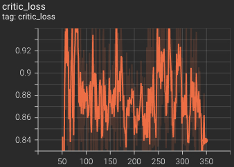
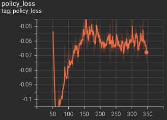
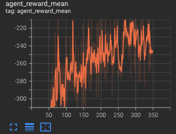
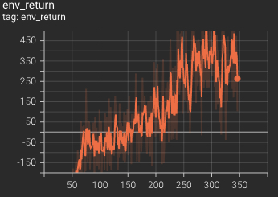

# 捕碳大作战 (Carbon Challenge) Baseline

本仓库为[捕碳大作战游戏](https://github.com/moliqingwa/carbon_challenge), 提供了基于Pytorch版本的PPO算法的基线方案供选手参考

## 目录
* `config`
  * `main_config.py`: 参数配置
* `train.py`: 捕碳大作战游戏的训练脚本主入口
* `carbon_game_runner.py`: 用于收集数据并进行PPO训练文件
* `algorithms`
  * `model.py`: 定义 actor 和 critic 网络架构
  * `test_model.py`: actor 和 critic 网络架构的测试文件
  * `base_policy.py`: 策略文件基础类,含义 actor 和 critic 网络，用于计算动作和值函数，以作训练和评估使用
  * `learner_policy.py`: 训练策略文件，PPO算法实现
  * `learner_partner_policy.py`: 用于self-play的对局机器人,加载最优模型与训练策略对局 (`selfplay=True` 时有效)
  * `eval_policy.py`: 评估策略文件，可以配合`test.ipynb`文件，加载模型文件，并在ipython中实时观看对局情况
* `envs`: 
  * `carbon_env.py`： Carbon游戏的包装类
  * `obs_parser.py`： 将原始状态数据(json类型)转换成状态特征
  * `carbon_trainer_env.py`: 训练使用的环境，内部包装了`carbon_env.py`和`obs_parser.py`，计算状态特征和奖励，通过`reset`接口和`step`接口返回
  * `test_carbon_trainer_env.py`： carbon_trainer_env测试文件
* `utils`:
  * `parallel_env.py`: 多进程环境封装,可配合`carbon_trainer_env.py`使用
  * `replay_buffer.py`: 训练使用的replay buffer类，训练数据由此获取
  * `trajectory_buffer.py`: 游戏进行过程中的临时存储区，用于收集每个agent的轨迹数据
  * `utils.py`: 常用的工具函数
* `static_resources`: 静态图片相关文件
* `model.pth`: 预训练模型

## 基线设计
我们使用PPO算法来控制每个agent（包括转化中心、种树员和捕碳员）,所有的agent共享同一个模型参数。

每个agent的目标是尽可能获取最大的金额奖励（在`carbon_trainer_env.py`文件中计算），采用端到端的训练来生成该基线模型，供选手使用。

## 快速开始
创建并激活一个虚拟的Python环境
```shell
conda create -n carbon python==3.9

conda activate carbon (OSx/Linux)
activate carbon (Windows)
```

安装依赖
```shell
pip install -r requirements.txt
```

## 训练
在 `config/main_config.py` 文件中修改超参数后并运行以下命令:
```shell
python train.py
```
命令行上会输出相关的训练信息，也可以通过tensorboard查看

## 验证
在 evaluate.py 中修改你的模型加载路径后运行脚本来测试你的模型效果。
```shell
python evaluate.py
```
需要注意的是，此测试脚本使用了一个内置的 random agent 作为对手。如果你需要对比其他智能体的话则需要修改 “random” 为对应的智能体方法。当你提交模型和方案到平台前，也可以使用此脚本来测试你的代码中是否无误。

## 结果
以下图片展示了训练过程中PPO算法的学习效果的部分截图。目前，我们仅选取了一个随机智能体作为对手。为了在赛事中得到较好的名次，选手应该训练出一个更为鲁棒的模型（如设计更好的状态特征、奖励函数、添加部分规则约束、改进算法等）。







## 可视化
当训练过程中，或训练完成后，可以打开ipython notebook查看。
```shell
jupyter lab
```
jupyter lab成功运行之后，会自动打开浏览器页面，此时选择`test.ipynb`,并选择`carbon` (或`ipykernel`) kernel。
依次运行两个cell，可以看到，模型策略 vs 内置random机器人的对局的动画情况。

可以修改你的模型文件位置，观看自己模型的情况。


## 提交
目前选手们只能提交一个文件到平台上，因此选手需要将需要用到的函数和模型都放置到同一个文件中。为了在文件中加载模型，选手需要先将模型编码成字节串然后放到文件中，在需要加载模型的地方将字节串解码。

选手可以参考 `encode_model.py` 查看如何编码模型，参考 `submission.py` 文件查看提交范例和加载模型，同时还提供了`submission_random_action.py`作为随机动作的可提交文件供选手参考。

需要注意的是，评分系统只会调用提交文件的最后一个函数方法。因此选手需要将智能体给出动作的函数方法放在提交文件的最后，此方法接收 observation 和 configuration作为输入，给出每艘飞船和基地的动作，具体选手可查看 `submission.py` 或 `submission_random_action.py` 文件。
